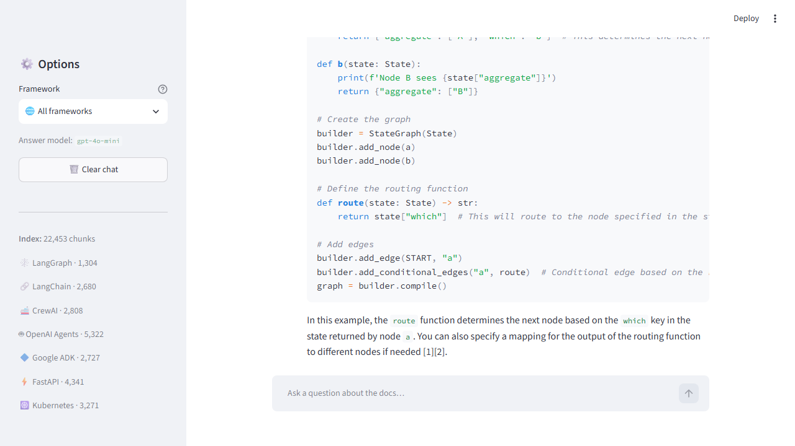

# 🧠 AI Engineering Documentation Assistant

A **Retrieval-Augmented Generation (RAG)** assistant that answers questions about popular AI-engineering frameworks — **with source citations** — so developers stop digging through docs.

Ask it _"How do I create a conditional edge in LangGraph?"_ and it retrieves the relevant documentation and answers, linking back to the exact source page.

> **Status:** ✅ Working end-to-end — see the [Roadmap](#-roadmap).



---

## ✨ Features

- 🔍 **Semantic search** across official documentation
- 💬 **Conversational Q&A** with follow-up questions
- 📎 **Source citations** on every answer
- 🧩 **Filter by framework** (ask within one framework or search all)
- ⚡ **Free, local embeddings** — no embedding API cost

## 📚 Supported frameworks

**LangGraph · LangChain · OpenAI SDK · Google ADK · CrewAI · FastAPI · Kubernetes**

## 🏗️ How it works

```
Indexing (once):   docs → crawl → chunk → embed → store in vector DB
Answering (live):  question → embed → search → relevant docs → LLM → cited answer
```

The LLM never answers from memory — it answers from the documentation we retrieve and hand to it, then cites where the answer came from.

## 🛠️ Tech stack

| Layer        | Tool                                                  |
| ------------ | ----------------------------------------------------- |
| Language / UI| Python · Streamlit                                    |
| Crawling     | requests · BeautifulSoup                              |
| Chunking     | langchain-text-splitters                              |
| Embeddings   | sentence-transformers (local, free)                   |
| Vector DB    | ChromaDB (local, free)                                |
| Generation   | OpenAI (`gpt-4o-mini`)                                |

## 🚀 Getting started

### Prerequisites

- Python 3.10+
- An [OpenAI API key](https://platform.openai.com/api-keys)

### Setup

```bash
# 1. Clone
git clone https://github.com/<your-username>/rag-devdocs-assistant.git
cd rag-devdocs-assistant

# 2. Create & activate a virtual environment
python -m venv venv
source venv/bin/activate        # Windows: venv\Scripts\activate

# 3. Install dependencies
pip install -r requirements.txt

# 4. Add your API key
cp .env.example .env            # Windows: Copy-Item .env.example .env
# then edit .env and paste your OpenAI key
```

### Run

```bash
python crawl.py        # 1. download the documentation
python ingest.py       # 2. build the search index
streamlit run app.py   # 3. launch the app
```

## 📁 Project structure

```
.
├── sources.py       # config: which frameworks to crawl + how
├── crawl.py         # download docs      → docs/<framework>/
├── ingest.py        # chunk + embed + store in ChromaDB
├── rag.py           # retrieve + ask the LLM (the core)
├── app.py           # Streamlit chat UI
├── requirements.txt
└── .env.example
```

## 🗺️ Roadmap

- [x] **Phase 0** — Project setup & GitHub scaffolding
- [x] **Phase 1** — Multi-framework crawler (all 7 frameworks, 829 pages)
- [x] **Phase 2** — Chunk, embed & store with metadata (22,453 chunks)
- [x] **Phase 3** — Retrieval + cited answers (core RAG)
- [x] **Phase 4** — Streamlit chat UI with framework filter
- [x] **Phase 5** — Polish (example prompts, source badges, live index stats, code-copy)
- [x] **Phase 6** — Evaluation harness (`eval.py`): 10/10 on retrieval, citation & keyword
- [ ] **Future** — version-aware retrieval, embedding upgrade (bge-base)

## 📄 License

Released under the MIT License. _(Optional — add a `LICENSE` file if you want one.)_
